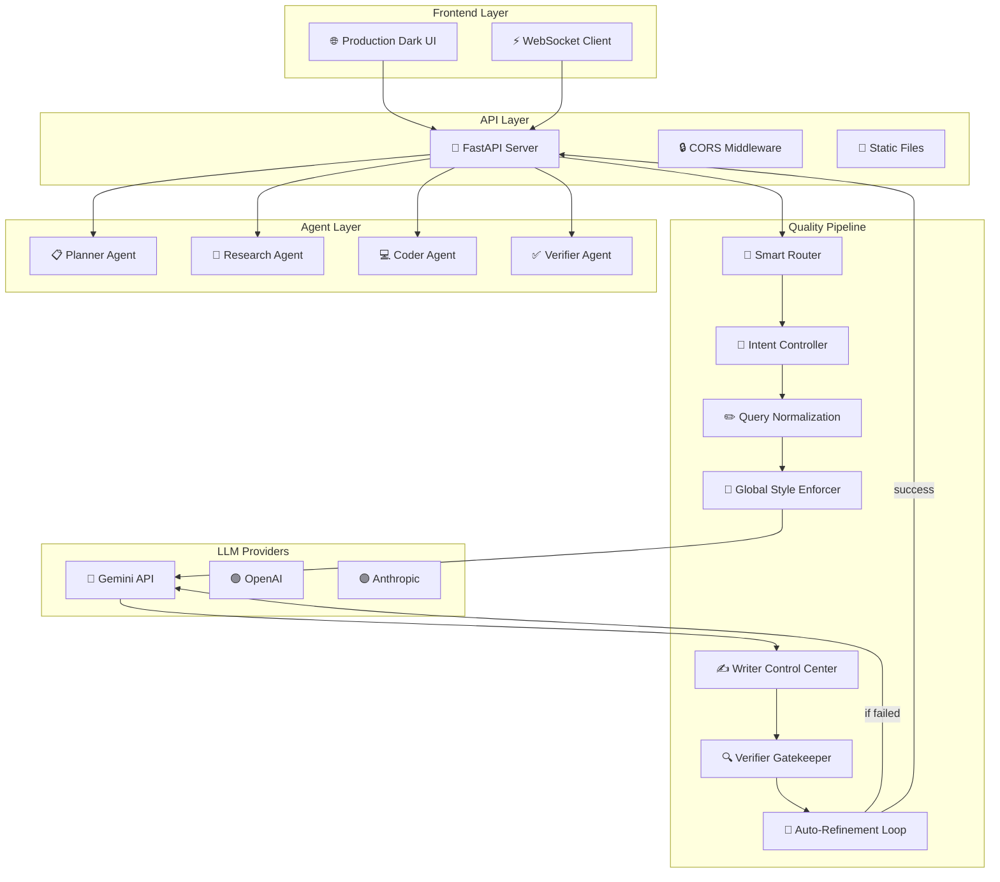

# 🤖 Autonomous Multi-Agent Executor

[](https://python.org)
[](https://fastapi.tiangolo.com)
[](https://ai.google.dev)
[](LICENSE)

> **Enterprise-grade multi-agent orchestration system** with specialized agents (Research, Writing, Coding, Verification) that autonomously collaborate to execute complex tasks with 9.5+ answer quality.

**[Live Demo](http://localhost:8000)** • **[API Docs](http://localhost:8000/docs)** • **[WebSocket](ws://localhost:8000/ws)**

---

## 🎯 What This Project Does

An intelligent multi-agent system where specialized agents work together to process tasks. The system features **smart query routing**, **9.5+ quality output pipeline**, and **real-time WebSocket communication** - all wrapped in a production-ready dark UI.

### Key Achievements
- ✅ **9.5+ Quality Pipeline** - Intent detection, query normalization, structured prompts, strict validation, auto-refinement
- ✅ **Smart Query Routing** - Automatically routes queries to appropriate agents (study plan, code generation, facts, etc.)
- ✅ **Multi-Provider LLM Support** - OpenAI, Anthropic, Gemini API integration
- ✅ **Production UI** - Enterprise dark theme with real-time updates
- ✅ **WebSocket Real-time** - Live task updates and agent status
- ✅ **Quality Gatekeeper** - Writer control center + Verifier strict validation

---

## 🏗️ System Architecture



---

## � Tech Stack

| Category | Technologies |
|----------|-------------|
| **Backend** |    |
| **AI/LLM** |   |
| **Frontend** |    |
| **Real-time** |  |
| **DevOps** |   |

---

## ✨ Key Features

### 🧠 9.5+ Quality Pipeline
1. **Intent Detection** - Automatically detects query type (study plan, code, facts, etc.)
2. **Query Normalization** - Rewrites queries for clarity (e.g., "alphabets" → "letters")
3. **Structured Prompts** - Strict output rules per query type
4. **Writer Control Center** - Final polish for relevance and structure
5. **Verifier Gatekeeper** - Strict validation (no truncation, no generic phrases, complete sentences)
6. **Auto-Refinement Loop** - 3-attempt automatic fix if validation fails

### 🤖 Multi-Agent Architecture
- **Planner Agent** - Task decomposition and orchestration
- **Research Agent** - Web research and data gathering
- **Writer Agent** - Content creation with 9.5+ quality control
- **Coder Agent** - Code generation and debugging
- **Verifier Agent** - Quality assurance and validation

### 🌐 Production UI
- **Dark Theme** - Enterprise-grade professional interface
- **Real-time Updates** - WebSocket live task progress
- **New Chat** - Clear history and reset functionality
- **Responsive** - Works on desktop, tablet, mobile

---

## 🚀 Quick Start

### Prerequisites
- Python 3.9+
- (Optional) PostgreSQL 13+, Redis 6+ for production

### Installation

```bash
# Clone the repository
git clone <repository-url>
cd Autonomous-Multi-Agent-Executor

# Set up environment
cp .env.example .env
# Edit .env and add your GEMINI_API_KEY

# Install dependencies
pip install -r requirements.txt

# Run the server
python server.py
```

### Access the Application
- **UI**: http://localhost:8000
- **API Docs**: http://localhost:8000/docs
- **WebSocket**: ws://localhost:8000/ws

---

## 📊 API Endpoints

### Core Endpoints
```
POST /api/execute              # Execute task with 9.5+ quality pipeline
GET  /api/agents               # List available agents
GET  /api/tasks                # Get recent tasks
GET  /api/stats                # System statistics
GET  /health                   # Health check
```

### WebSocket Events
```javascript
// Connect to WebSocket
const ws = new WebSocket('ws://localhost:8000/ws');

// Listen for updates
ws.onmessage = (event) => {
    const data = JSON.parse(event.data);
    console.log('Task update:', data);
};
```

---

## 🔧 Configuration

### Environment Variables
```env
# Required
GEMINI_API_KEY=your_gemini_api_key_here

# Optional
OPENAI_API_KEY=your_openai_key
ANTHROPIC_API_KEY=your_anthropic_key
DEBUG=false
PORT=8000
```

---

## 📁 Project Structure

```
Autonomous-Multi-Agent-Executor/
├── 📁 app/
│   ├── 📁 agents/              # Agent modules
│   │   ├── writer.py          # Control center for 9.5+ quality
│   │   ├── verifier.py        # Strict gatekeeper validation
│   │   ├── router.py          # Smart query routing
│   │   ├── planner.py
│   │   ├── researcher.py
│   │   └── coder.py
│   ├── 📁 executor/
│   └── 📁 api/
├── 📁 ui/                      # Production dark UI
│   ├── index.html
│   ├── style.css
│   └── app.js
├── 📁 docker/
├── 📁 tests/
├── server.py                   # Main FastAPI server
└── README.md
```

---

## 🧪 Testing

```bash
# Run tests
python -m pytest tests/

# With coverage
python -m pytest tests/ --cov=app
```

---

## 🚀 Deployment

### Docker
```bash
docker-compose up -d
```

### Production
```bash
export NODE_ENV=production
gunicorn server:app -w 4 -k uvicorn.workers.UvicornWorker
```

---

## 🎯 Use Cases

- **Study Plans** - "Create a 30-day Python study plan"
- **Code Generation** - "Write a function to sort an array"
- **Research** - "Explain quantum computing in simple terms"
- **Content Creation** - Technical documentation, blog posts
- **Data Analysis** - Automated report generation

---

## 🤝 Contributing

1. Fork the repository
2. Create a feature branch (`git checkout -b feature/amazing-feature`)
3. Commit changes (`git commit -m 'Add amazing feature'`)
4. Push to branch (`git push origin feature/amazing-feature`)
5. Open a Pull Request

---

## 📄 License

This project is licensed under the MIT License.

---

## 🚀 Ready for Production!

- ✅ **9.5+ Quality Pipeline** - Intent detection → Auto-refinement
- ✅ **Enterprise Architecture** - Scalable, modular, maintainable
- ✅ **Production UI** - Dark theme, real-time updates
- ✅ **Multi-Provider LLM** - Gemini, OpenAI, Anthropic
- ✅ **WebSocket Real-time** - Live task progress
- ✅ **Quality Gatekeeper** - Writer + Verifier validation

**Built with ❤️ for enterprise AI automation**